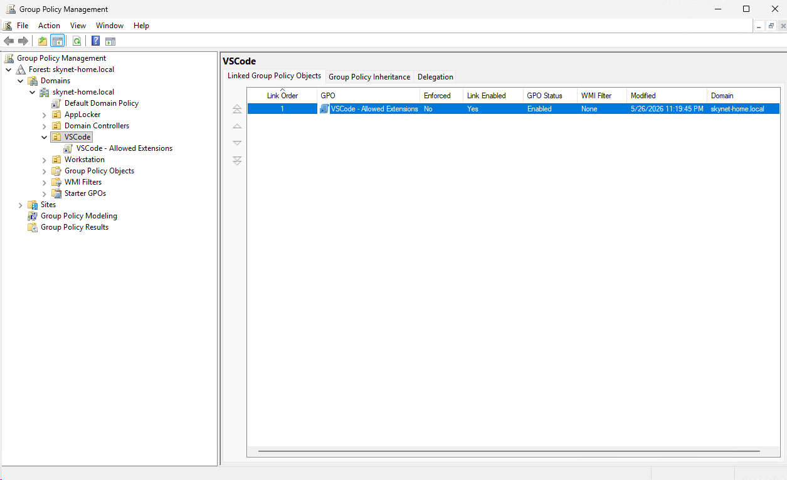
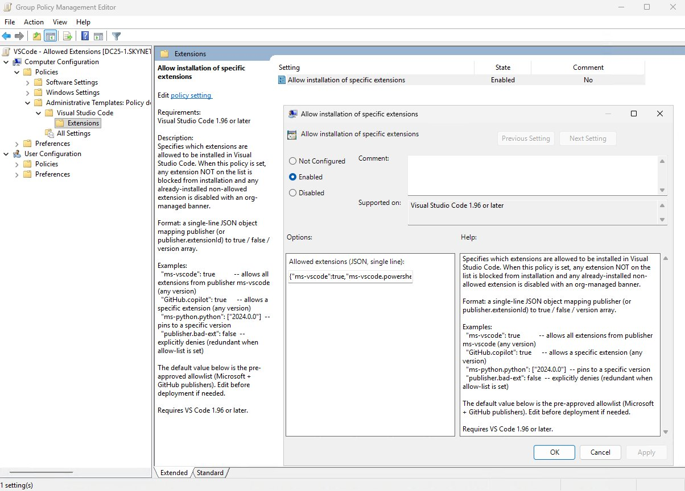
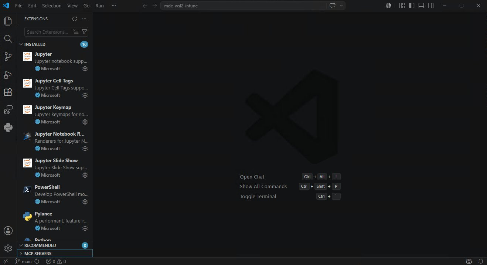
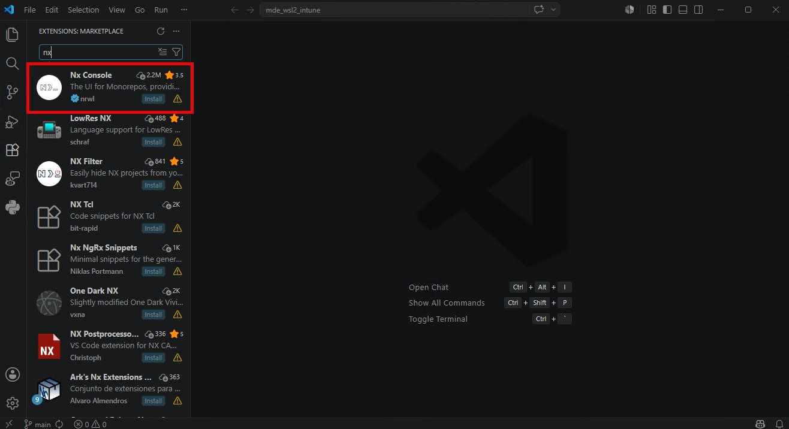
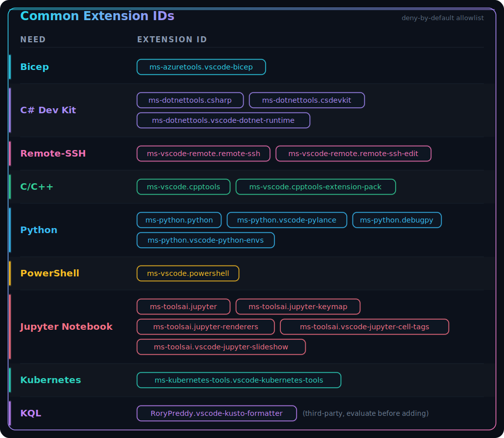

# 🔐 VS Code Extension Policy

Centrally control which Visual Studio Code extensions are allowed on managed Windows endpoints — deny-by-default — via **Active Directory Group Policy** or **Microsoft Intune**. Ships the ADMX/ADML templates, a reference allowlist, the Intune Remediation scripts, and a Defender hunt query for the incident that motivated it.

## Why this exists

The May 2026 [Nx Console supply-chain compromise (CVE-2026-48027)](https://github.com/nrwl/nx-console/security/advisories/GHSA-c9j4-9m59-847w) showed that a single poisoned VS Code extension — pushed through auto-update in an 18-minute window — can harvest GitHub PATs, AWS keys, npm tokens, 1Password vaults, and Anthropic / Claude Code configs from a developer machine. The malicious version reached ~6,000 installs before takedown, and GitHub disclosed that ~3,800 internal repos were exfiltrated from a single employee device running it.

This repo enforces a **deny-by-default extension allowlist** so unapproved publishers — including future compromised ones — cannot be installed or activated on managed endpoints.

## Repository structure

```
.
├── README.md
├── CONTRIBUTORS.md
├── vscode_extension_allowlist.json   # Source of truth: the approved extensions
├── sync_allowlist.ps1                # Stamps the allowlist into the scripts + ADML (-Check for CI)
├── vscode_central_store.ps1          # Helper: copy ADMX/ADML to the AD Central Store
├── admx/
│   ├── vscode.admx                   # ADMX template (AllowedExtensions + UpdateMode)
│   └── vscode.adml                   # Strings + pre-filled default allowlist
├── intune/
│   ├── Detection.ps1                 # Intune Remediation: detection
│   ├── Remediation.ps1               # Intune Remediation: writes the value as SYSTEM
│   └── instructions.md               # Intune how-to (two approaches: what fails, what works)
└── images/                           # Screenshots used in this guide
```

## How it works

VS Code 1.96+ honors the `AllowedExtensions` policy at `HKLM\SOFTWARE\Policies\Microsoft\VSCode\AllowedExtensions`. When set, only listed extensions can be installed; everything else is blocked in the Marketplace UI, and any already-installed non-allowed extension is disabled with an org-managed banner.

The value is a **single-line JSON object** mapping publisher or `publisher.extensionId` IDs to `true` / `false` / a version array. The same value can be delivered two ways — on-prem via Group Policy, or in the cloud via Intune (see [Deployment](#deployment)).

## ⚠️ Critical gotcha: publisher-level entries are unreliable

The VS Code docs suggest publisher-level entries like `"ms-python": true` allow every extension from that publisher. **In practice this breaks for any extension that depends on others to activate** (tracked in [microsoft/vscode#243536](https://github.com/microsoft/vscode/issues/243536) and [#238751](https://github.com/microsoft/vscode/issues/238751)).

Confirmed broken with a publisher-level allow:

- `ms-python` — Python installs, but Pylance and Debugpy fail to activate
- `ms-vscode.powershell` — fails to load when only `ms-vscode` is allowed (its language host has dependency activation)
- `ms-toolsai` — Jupyter notebook rendering breaks

**Fix:** use the full `publisher.extensionId` form for any extension with dependencies — see `vscode_extension_allowlist.json` for the working set. Wildcards (`"ms-python.*"`) are **not** supported; only the literal `"*"` (all extensions) is valid.

## Deployment

Pick the channel that matches how your endpoints are managed. Both write the identical registry value.

| Channel | Use when | Guide |
|---|---|---|
| **Active Directory (GPO)** | On-prem / domain-joined endpoints | [below](#active-directory-group-policy) |
| **Microsoft Intune** | Cloud-managed (Entra-joined) endpoints | [intune/instructions.md](intune/instructions.md) |

> Author the allowlist once in `vscode_extension_allowlist.json`, then deploy it through either channel. `sync_allowlist.ps1` keeps the GPO templates and the Intune scripts byte-identical (see [Maintenance](#maintenance)).

### Active Directory (Group Policy)

#### 1. Copy templates to the Central Store

On a Domain Controller (elevated PowerShell):

```powershell
$cs = "\\$env:USERDNSDOMAIN\SYSVOL\$env:USERDNSDOMAIN\Policies\PolicyDefinitions"
New-Item -Path $cs -ItemType Directory -Force | Out-Null
New-Item -Path "$cs\en-US" -ItemType Directory -Force | Out-Null

Copy-Item -Path ".\admx\vscode.admx" -Destination $cs -Force
Copy-Item -Path ".\admx\vscode.adml" -Destination "$cs\en-US" -Force
```

#### 2. Create and link the GPO

1. Open **Group Policy Management Console** (`gpmc.msc`).
2. Right-click the OU containing your VS Code endpoints → **Create a GPO in this domain, and Link it here**.
3. Name it `VSCode - Allowed Extensions`, then right-click it → **Edit**.



#### 3. Configure the policy

Go to **Computer Configuration → Policies → Administrative Templates → Visual Studio Code → Extensions → Allow installation of specific extensions** and set it to **Enabled**. The textbox is pre-populated with the allowlist from `vscode_extension_allowlist.json`; edit only to add or remove approved extensions.



#### 4. Apply and verify on a client

```powershell
gpupdate /target:computer /force

# Confirm the policy reached the registry
$v = (Get-ItemProperty 'HKLM:\SOFTWARE\Policies\Microsoft\VSCode' AllowedExtensions).AllowedExtensions
$v.Length
$v | ConvertFrom-Json   # Must parse cleanly; if this errors, GPO truncated the value
```

### Microsoft Intune

Same allowlist, cloud delivery — but there's a catch worth knowing up front. Intune offers two routes, and **the obvious one does not work**:

- **Imported ADMX profile — fails.** Reusing `vscode.admx` as an Imported Administrative Template imports and assigns cleanly, then **errors on the endpoint**. Windows MDM ADMX ingestion refuses to write `HKLM\SOFTWARE\Policies\Microsoft\VSCode` because that key is not on Microsoft's reserved-key carve-out list, so the value is never set (`Event 850 → 0x80070005`).
- **Remediation script as SYSTEM — works.** The supported workaround, which Microsoft documents, is to write the value directly with PowerShell. The included [`Detection.ps1`](intune/Detection.ps1) and [`Remediation.ps1`](intune/Remediation.ps1) run as SYSTEM and enforce the allowlist.

The full step-by-step — both routes, screenshots, and the root cause — is in **[intune/instructions.md](intune/instructions.md)**.

## Verification

After deploying through either channel and restarting VS Code:

**Approved extensions activate normally.** Below, ten Microsoft-published extensions (Jupyter suite, PowerShell, Pylance, Python) install and run.



**Non-allowed extensions are blocked.** Searching the Marketplace for a non-allowlisted extension (e.g., `nx`) shows `Install` greyed out — the Nx Console extension compromised in CVE-2026-48027 cannot be installed regardless of version.



## Maintenance

The allowlist has one source of truth — `vscode_extension_allowlist.json` — but the value is duplicated into the ADML default and both Intune scripts so endpoints never depend on network access at run time. Keep every copy byte-identical with the bundled helper:

```powershell
.\sync_allowlist.ps1          # stamp the JSON into Detection.ps1, Remediation.ps1, and vscode.adml
.\sync_allowlist.ps1 -Check   # CI / pre-commit guard: non-zero exit if any copy has drifted
```

### Adding a new approved extension

1. Find the full ID `publisher.extensionId` (in the Marketplace URL: `marketplace.visualstudio.com/items?itemName=publisher.extensionId`).
2. Add it to `vscode_extension_allowlist.json`, run `.\sync_allowlist.ps1`, and commit the changes together.
3. **GPO:** paste the updated JSON into the policy textbox. **Intune:** re-upload both scripts.
4. `gpupdate /force` (or trigger an Intune sync) on a pilot endpoint, restart VS Code, confirm the extension loads, then let it propagate (GPO default refresh: 90–120 min).

### Updating the ADML default

`sync_allowlist.ps1` also refreshes the `<defaultValue>` in `admx/vscode.adml` so newly created GPOs pre-populate with the latest allowlist. This does **not** retroactively change already-deployed GPOs — their value lives in `registry.pol`, not the ADML.

### Common extension IDs



## Hunt query — detecting compromise from CVE-2026-48027

If a host ran Nx Console v18.95.0 before this policy was deployed, the policy blocks future loads but does **not** remove the persistence artifacts (cat.py Python backdoor, kitty LaunchAgent, `/var/tmp/.gh_update_state`). Run this in **Microsoft Defender XDR → Advanced Hunting** to find already-compromised endpoints for credential rotation and cleanup.

Key indicators:

- File: `~/.local/share/kitty/cat.py`, `~/Library/LaunchAgents/com.user.kitty-monitor.plist`, `/var/tmp/.gh_update_state`
- Process: command line containing `558b09d7ad0d1660e2a0fb8a06da81a6f42e06d2` or `github:nrwl/nx#558`
- Network: HTTPS to `api.github.com/search/commits?q=firedalazer`

```kql
let Lookback = 30d;
let MaliciousCommit = "558b09d7ad0d1660e2a0fb8a06da81a6f42e06d2";
let MaliciousRef = "github:nrwl/nx#558";
let GitHubSearchTerm = "firedalazer";
let FileHits =
	DeviceFileEvents
	| where Timestamp >= ago(Lookback)
	| extend FolderPathLower = tolower(FolderPath), FileNameLower = tolower(FileName)
	| where FileNameLower in ("cat.py", "com.user.kitty-monitor.plist", ".gh_update_state")
		or FolderPathLower contains "/.local/share/kitty/cat.py"
		or FolderPathLower contains "\\.local\\share\\kitty\\cat.py"
		or FolderPathLower contains "/library/launchagents/com.user.kitty-monitor.plist"
		or FolderPathLower contains "\\library\\launchagents\\com.user.kitty-monitor.plist"
		or FolderPathLower contains "/var/tmp/.gh_update_state"
		or FolderPathLower contains "\\var\\tmp\\.gh_update_state"
		or FolderPathLower contains "nrwl.angular-console-18.95.0"
		or FolderPathLower contains "nx-console-18.95.0"
	| extend Indicator = case(
		FolderPathLower contains "cat.py", "cat.py Python backdoor",
		FolderPathLower contains "kitty-monitor.plist", "kitty LaunchAgent persistence",
		FolderPathLower contains ".gh_update_state", "GitHub update state artifact",
		FolderPathLower contains "nrwl.angular-console-18.95.0" or FolderPathLower contains "nx-console-18.95.0", "Nx Console v18.95.0 extension path",
		"Suspicious file indicator")
	| project Timestamp, DeviceName, DeviceId, EvidenceType = "File", Indicator, ActionType, Evidence = FolderPath, InitiatingProcessFileName, InitiatingProcessCommandLine;
let ProcessHits =
	DeviceProcessEvents
	| where Timestamp >= ago(Lookback)
	| extend CommandLineEvidence = strcat(ProcessCommandLine, " ", InitiatingProcessCommandLine)
	| where CommandLineEvidence contains MaliciousCommit
		or CommandLineEvidence contains MaliciousRef
		or CommandLineEvidence contains GitHubSearchTerm
	| extend Indicator = case(
		CommandLineEvidence contains MaliciousCommit, "Malicious commit hash in command line",
		CommandLineEvidence contains MaliciousRef, "Malicious GitHub ref in command line",
		CommandLineEvidence contains GitHubSearchTerm, "GitHub search term in command line",
		"Suspicious process indicator")
	| project Timestamp, DeviceName, DeviceId, EvidenceType = "Process", Indicator, ActionType, Evidence = ProcessCommandLine, InitiatingProcessFileName, InitiatingProcessCommandLine;
let NetworkHits =
	DeviceNetworkEvents
	| where Timestamp >= ago(Lookback)
	| extend NetworkEvidence = strcat(RemoteUrl, " ", RemoteIP, ":", RemotePort, " ", InitiatingProcessCommandLine)
	| where NetworkEvidence contains "api.github.com/search/commits"
		or (RemoteUrl =~ "api.github.com" and InitiatingProcessCommandLine contains GitHubSearchTerm)
		or NetworkEvidence contains GitHubSearchTerm
	| extend Indicator = case(
		NetworkEvidence contains "api.github.com/search/commits", "GitHub commit search URL",
		NetworkEvidence contains GitHubSearchTerm, "GitHub search term network evidence",
		"Suspicious network indicator")
	| project Timestamp, DeviceName, DeviceId, EvidenceType = "Network", Indicator, ActionType, Evidence = NetworkEvidence, InitiatingProcessFileName, InitiatingProcessCommandLine;
union FileHits, ProcessHits, NetworkHits
| summarize
	FirstSeen = min(Timestamp),
	LastSeen = max(Timestamp),
	HitCount = count(),
	Indicators = make_set(Indicator, 20),
	Evidence = make_set(Evidence, 20),
	InitiatingProcesses = make_set(InitiatingProcessFileName, 20),
	InitiatingCommandLines = make_set(InitiatingProcessCommandLine, 20),
	ActionTypes = make_set(ActionType, 20)
	by DeviceName, DeviceId, EvidenceType
| order by LastSeen desc
```
## References

- [VS Code: Manage extensions in enterprise environments](https://code.visualstudio.com/docs/enterprise/extensions)
- [VS Code: Centrally manage settings with policies](https://code.visualstudio.com/docs/enterprise/policies)
- [Win32 and Desktop Bridge app ADMX policy Ingestion](https://learn.microsoft.com/windows/client-management/win32-and-centennial-app-policy-configuration) — why imported ADMX fails in Intune (the reserved-key list)
- [Nx Console GHSA-c9j4-9m59-847w](https://github.com/nrwl/nx-console/security/advisories/GHSA-c9j4-9m59-847w) — original advisory
- [Nx postmortem](https://nx.dev/blog/nx-console-v18-95-0-postmortem)
- [StepSecurity threat intel writeup](https://www.stepsecurity.io/blog/nx-console-vs-code-extension-compromised)

## License

Internal use. Not for external distribution without review.
