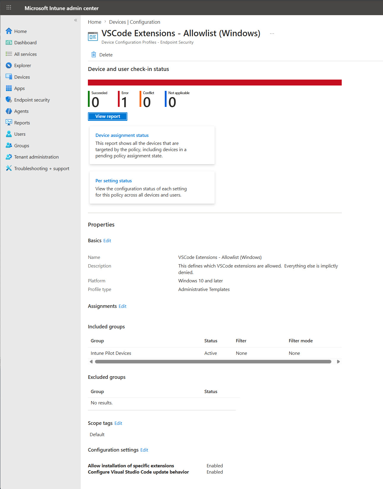
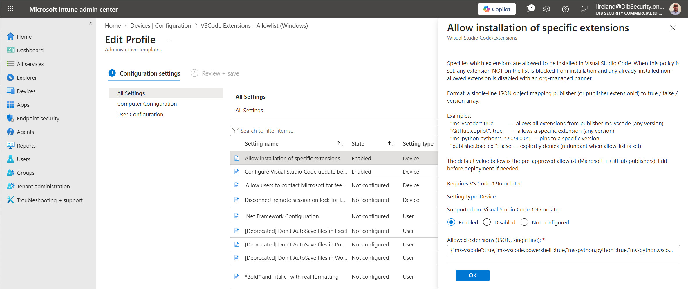
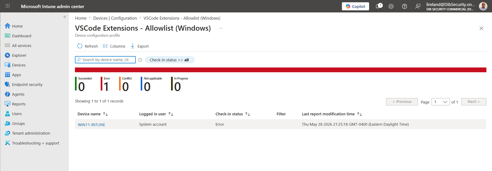
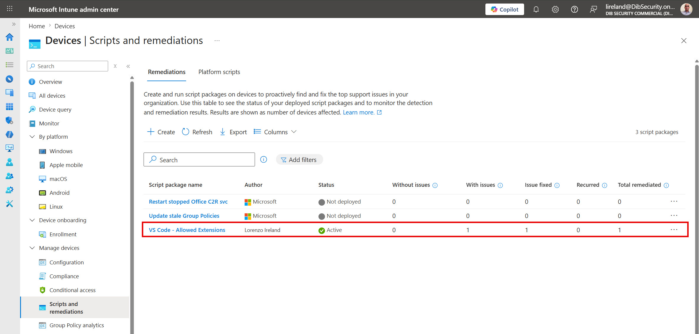
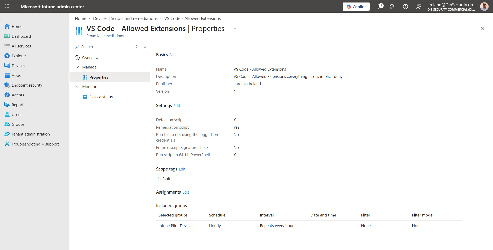
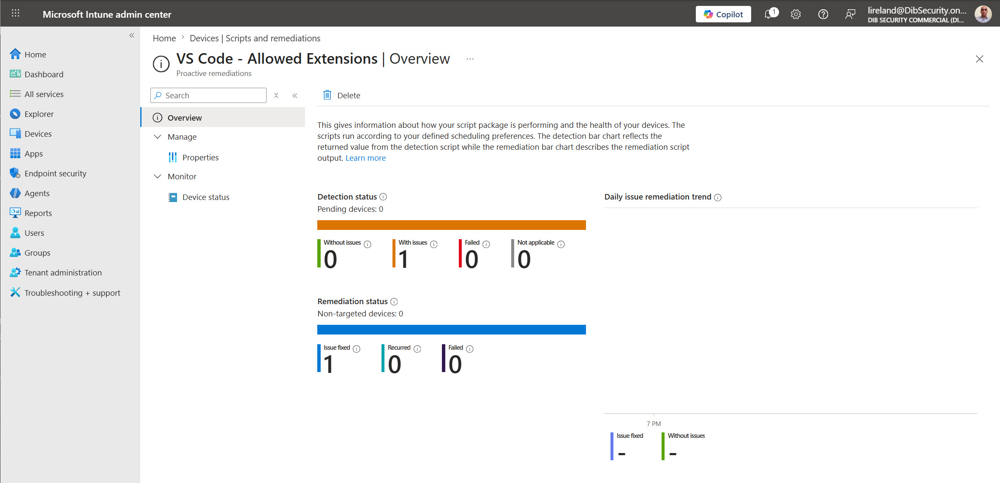
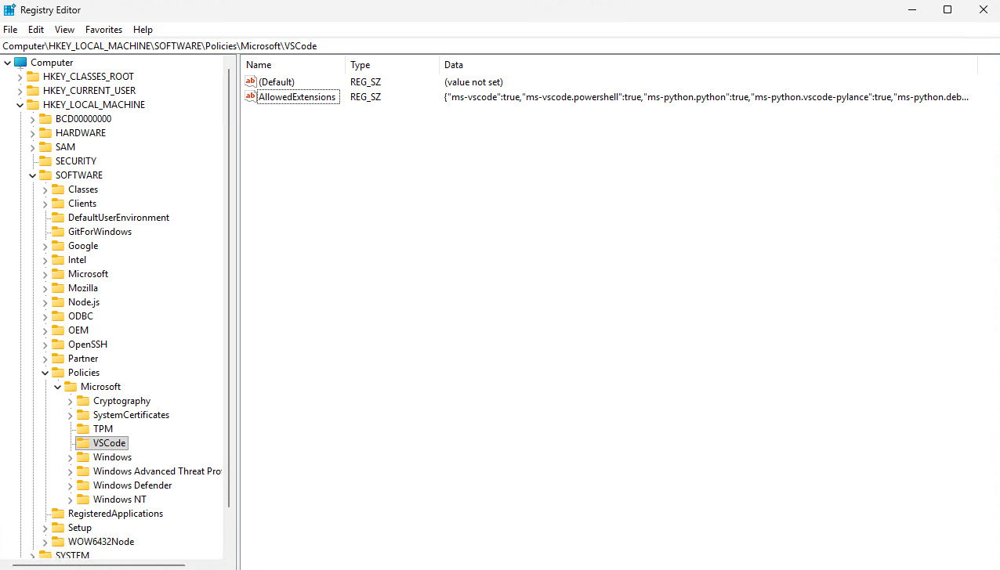
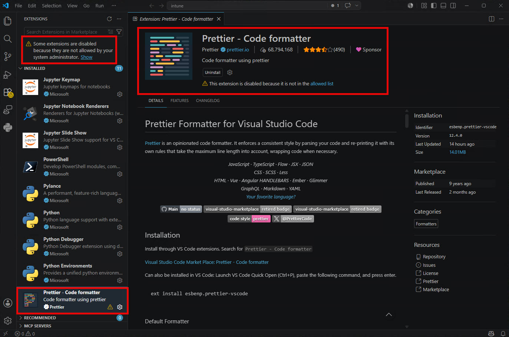
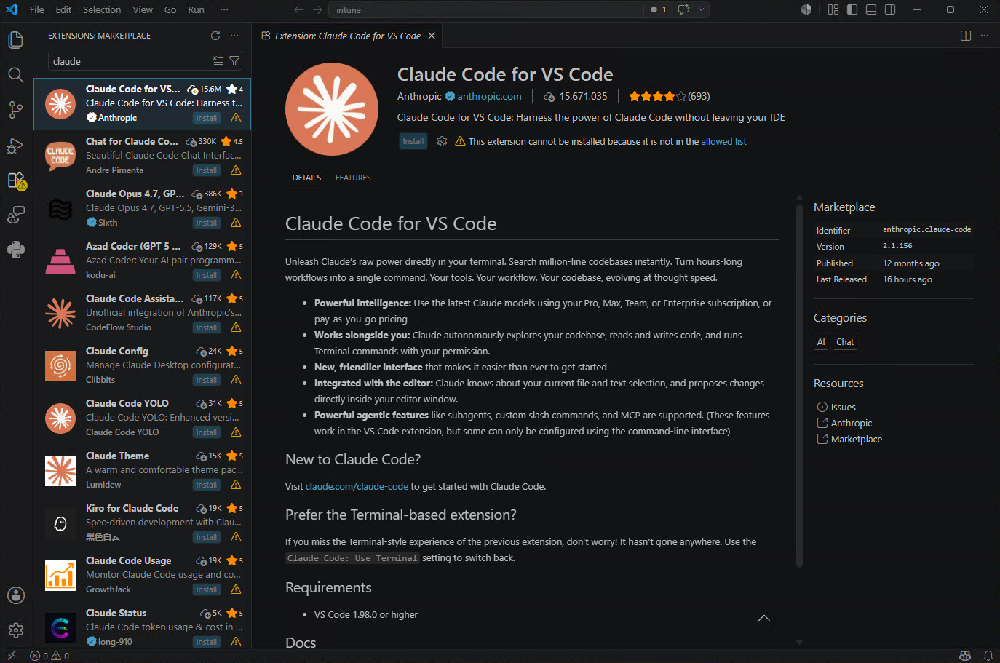

# Deploying the VS Code AllowedExtensions Policy with Microsoft Intune

The repository [README](../README.md) covers the on-prem **Active Directory (Group Policy)** path. This guide covers the **Microsoft Intune** path for cloud-managed Windows endpoints.

The objective is identical to the GPO side: set the machine-policy value

```
HKLM\SOFTWARE\Policies\Microsoft\VSCode\AllowedExtensions
```

to the approved single-line JSON allowlist ([`vscode_extension_allowlist.json`](../vscode_extension_allowlist.json)) so Visual Studio Code installs and activates only approved publishers/extensions and blocks everything else (deny-by-default).

There are two ways to attempt this in Intune. **The obvious one does not work; the supported one does.** This guide walks through both — what you would try first, why it fails on the endpoint, and the approach that actually enforces the policy — so the dead end is understood instead of rediscovered.

## TL;DR

| | Approach 1 — Imported ADMX | Approach 2 — Remediation script |
|---|---|---|
| Mechanism | Import `vscode.admx`, configure as an Administrative Template | PowerShell detection + remediation run as SYSTEM |
| Writes the policy value? | No — blocked during ADMX ingestion | Yes — written directly to HKLM |
| Endpoint result | **Error** (0 succeeded, 1 error) | **Success** — policy enforced |
| Recommended | No | **Yes** |

## Prerequisites

- Windows endpoints enrolled in Intune (Entra-joined).
- A device group targeting your managed VS Code endpoints.
- Visual Studio Code **1.96 or later** (required by the `AllowedExtensions` policy).
- The approved value from [`vscode_extension_allowlist.json`](../vscode_extension_allowlist.json).

---

## Approach 1 — Imported ADMX Administrative Template (does not work)

### What you would try

The intuitive move is to reuse the same `vscode.admx` / `vscode.adml` templates from the GPO solution by importing them into Intune and configuring them as an Administrative Template:

1. Intune admin center > **Devices** > **Configuration** > **Import ADMX**, and upload `vscode.admx` and `vscode.adml`.
2. Create a **Configuration profile** > **Templates** > **Imported Administrative templates**.
3. Enable **Allow installation of specific extensions** and paste the single-line allowlist JSON.
4. Assign the profile to your device group.

The profile is accepted and the setting surfaces correctly in the portal:





### What actually happens on the endpoint

The profile imports and assigns without complaint, but it **fails when the endpoint applies it**. The device reports `Error`, evaluated under the System account (expected for a device-scoped Administrative Template):



### Why it fails

This is **not** a malformed allowlist and **not** a user sign-in problem. Windows MDM ADMX ingestion runs a reserved-key safety check and refuses to write the target key. The device-side MDM diagnostics (Event Viewer > `Microsoft-Windows-DeviceManagement-Enterprise-Diagnostics-Provider/Admin`) show the decisive chain:

```text
Event 850   MDM PolicyManager ADMX Ingestion: Blocked registry key:
            (SOFTWARE\Policies\Microsoft\VSCode) in (policy) tag.
Event 865   ADMX Ingestion result: (0x80070005) Access is denied.
Event 404   MDM ConfigurationManager: Command failure status,
            CSP URI ./Device/Vendor/MSFT/Policy/ConfigOperations/ADMXInstall/...
```

Microsoft documents this behavior. Ingested ADMX policies are **not allowed to write** under the `System`, `Software\Microsoft`, or `Software\Policies\Microsoft` keys, *except* for a fixed carve-out list (Office, Internet Explorer, Edge, EdgeUpdate, OneDrive, and — notably — `Software\Policies\Microsoft\VisualStudio`). `Software\Policies\Microsoft\VSCode` **is not on that list**, so the write is refused. Visual Studio (the full IDE) is carved out; Visual Studio Code is not. On-prem Group Policy performs no such check, which is exactly why the identical templates succeed under AD GPO but fail through Intune ADMX ingestion.

> **Key point:** the limitation lives in the MDM/ADMX-ingestion channel, not in the templates or the JSON. Don't spend time validating the allowlist or chasing user/login state — change the delivery method.

Reference: [Win32 and Desktop Bridge app ADMX policy Ingestion](https://learn.microsoft.com/windows/client-management/win32-and-centennial-app-policy-configuration). The same page gives the way out: *"Settings that can't be configured using custom policy ingestion have to be set by pushing the appropriate registry keys directly (for example, by using a PowerShell script)."*

---

## Approach 2 — Intune Remediation script as SYSTEM (recommended)

Microsoft's own guidance points to the fix: when ADMX ingestion can't reach a key, **write the registry value directly with PowerShell**. Intune **Remediations** (formerly Proactive Remediations) run a detection + remediation script pair **as SYSTEM** on a schedule — precisely what's needed to set a machine-policy value the supported way.

This repo ships the pair (in this `intune/` directory):

- [`Detection.ps1`](Detection.ps1) — reads `HKLM\SOFTWARE\Policies\Microsoft\VSCode\AllowedExtensions` and exits `0` only when it matches the approved JSON byte-for-byte; exits `1` (drift) otherwise.
- [`Remediation.ps1`](Remediation.ps1) — confirms the JSON parses, then writes it to that value as SYSTEM.

The approved JSON is embedded in both scripts so endpoints never depend on network access, GitHub availability, or repo authentication at run time. Keep the two copies in sync (see [Maintenance](#maintenance)).

### Create the remediation

1. Intune admin center > **Devices** > **Scripts and remediations** > **Remediations**.
2. **Create**, and name it e.g. `VS Code - Allowed Extensions`.
3. Upload `Detection.ps1` as the **detection** script and `Remediation.ps1` as the **remediation** script.
4. Settings:
   - **Run this script using the logged-on credentials** → **No** (runs as SYSTEM)
   - **Enforce script signature check** → **No** (unless you sign both scripts before upload)
   - **Run script in 64-bit PowerShell** → **Yes**
5. Assign it to your VS Code device group. An **hourly** schedule gives fast drift correction; choose a longer interval if change control requires it.

Quick reference:

```text
Devices > Scripts and remediations > Create
Detection script:   intune/Detection.ps1
Remediation script: intune/Remediation.ps1
Run as logged-on:   No
Enforce signature:  No
64-bit PowerShell:  Yes
Assignment:         VS Code devices group, hourly schedule
```

Once created, the package shows as **Active**; after devices check in you will see issues detected and fixed:







### Verify on the endpoint

After the remediation runs (or trigger an Intune device sync), confirm the value exists and parses as JSON:

```powershell
$value = (Get-ItemProperty 'HKLM:\SOFTWARE\Policies\Microsoft\VSCode' AllowedExtensions).AllowedExtensions
$value.Length
$value | ConvertFrom-Json   # must parse cleanly
```

The value is now present in the registry — the exact key that ADMX ingestion could not write:



Restart VS Code and confirm enforcement. Approved extensions load normally; anything not on the allowlist is blocked from installation/activation and shown as disabled by your organization. For example, a non-allowlisted formatter is blocked:



Because the policy is deny-by-default, even widely used or first-party extensions are blocked unless explicitly approved:



(Optional) Run **Developer: Policy Diagnostics** from the VS Code Command Palette to confirm it sees the `AllowedExtensions` enterprise policy.

---

## Maintenance

The approved JSON intentionally lives in more than one place: `vscode_extension_allowlist.json`, the `<defaultValue>` in `vscode.adml` (GPO side), and `Detection.ps1` + `Remediation.ps1` (Intune side). When the allowlist changes, every copy must stay byte-identical. The repo includes [`sync_allowlist.ps1`](../sync_allowlist.ps1) to stamp the source JSON into the scripts (and ADML), plus a `-Check` mode for CI / pre-commit:

```powershell
# from the repo root
.\sync_allowlist.ps1          # update Detection.ps1, Remediation.ps1, and vscode.adml from the JSON
.\sync_allowlist.ps1 -Check   # validate-only: non-zero exit if any copy has drifted
```

Manual process, if you prefer:

1. Update `vscode_extension_allowlist.json`.
2. Update the JSON inside both scripts, between the `KEEP IN SYNC` comment blocks.
3. Confirm the two script values are byte-identical, commit them together, and re-upload both scripts to the remediation.

If only one script is updated, endpoints alternate between detected drift and successful remediation — noisy by design, so a mismatch is visible in Intune reporting.

## Why this guide documents the failed path

The imported-ADMX route is the first thing most admins try, and it looks like it should work right up until the endpoint errors out. Capturing the root cause (the reserved-key list) next to the supported alternative (SYSTEM remediation) saves the next person from the same dead end.

## References

- [Win32 and Desktop Bridge app ADMX policy Ingestion](https://learn.microsoft.com/windows/client-management/win32-and-centennial-app-policy-configuration) — the reserved-key list and the "write registry keys directly via PowerShell" guidance.
- [Understanding ADMX-backed policies](https://learn.microsoft.com/windows/client-management/understanding-admx-backed-policies)
- [Policy CSP](https://learn.microsoft.com/windows/client-management/mdm/policy-configuration-service-provider)
- [VS Code: Manage extensions in enterprise environments](https://code.visualstudio.com/docs/enterprise/extensions)
